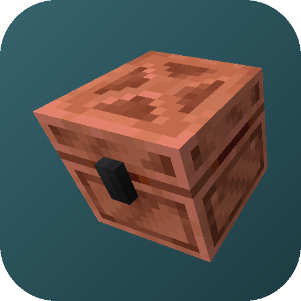
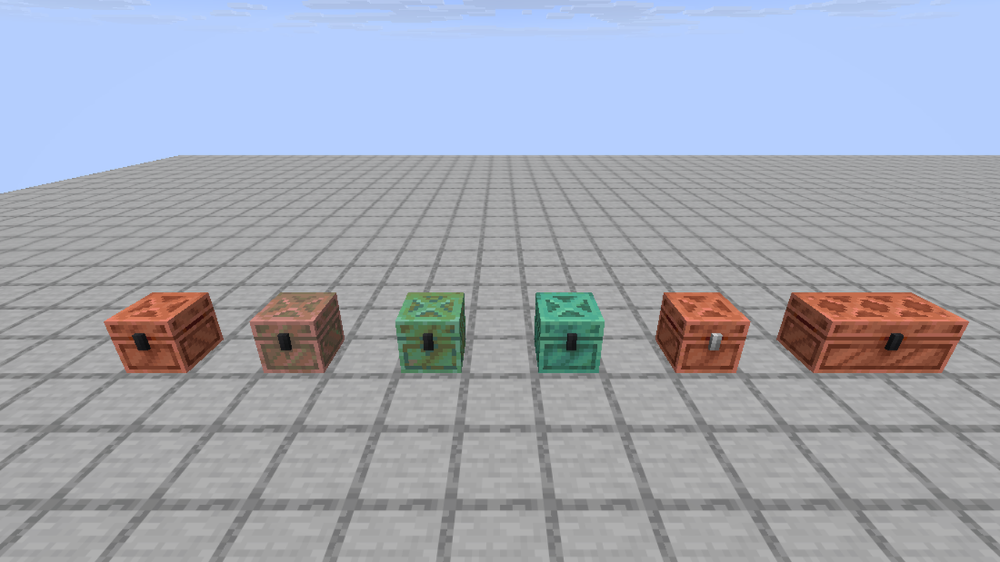
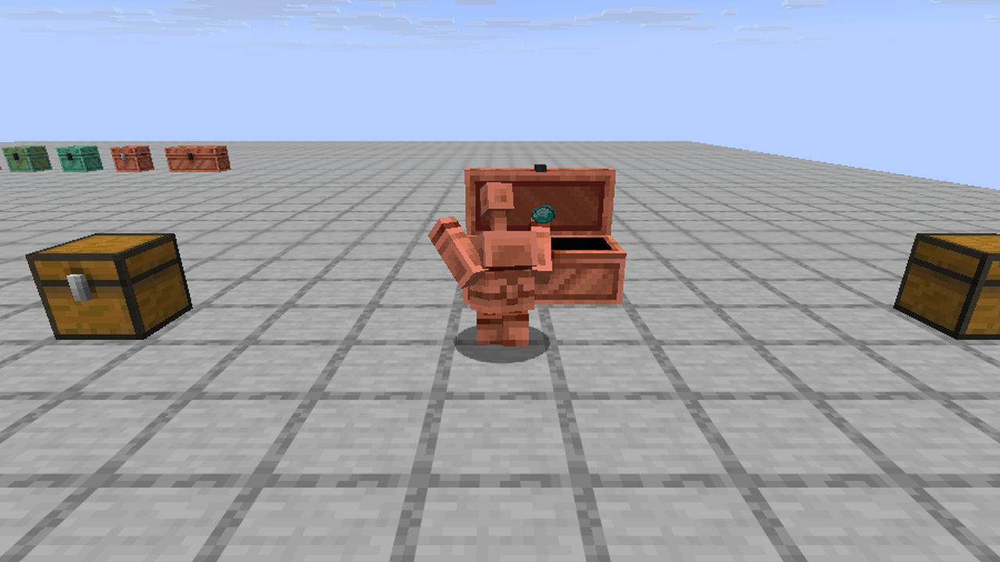
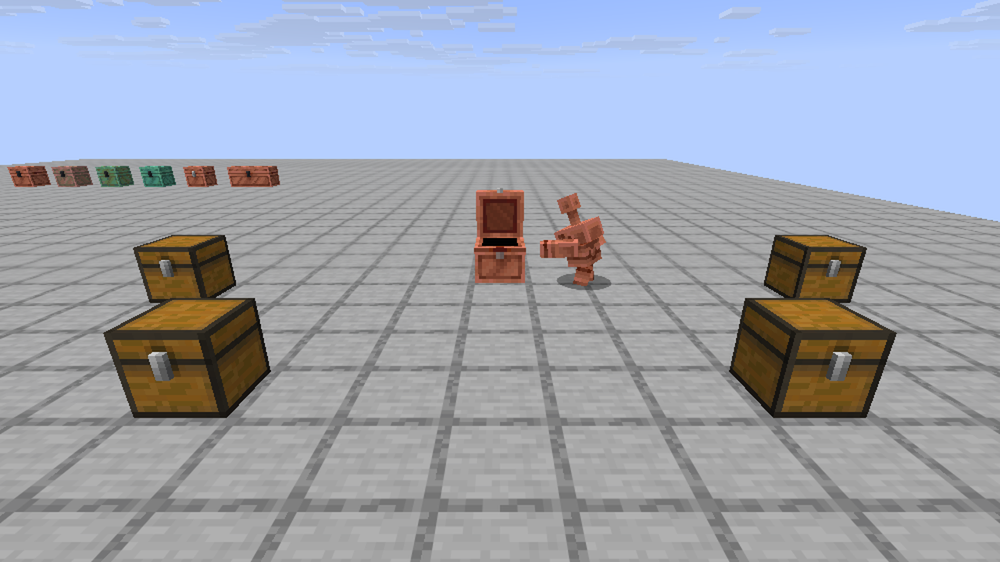
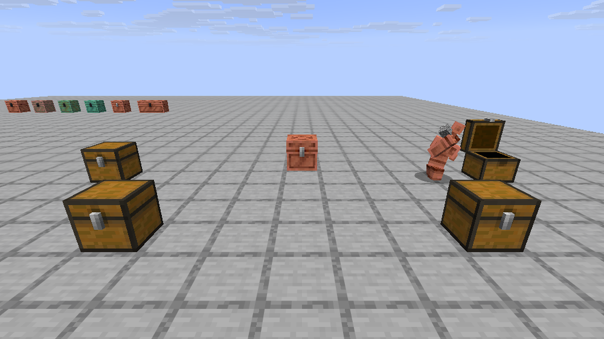

<!-- GENERATED FILE: edit README.template.md instead (see tools/RenderReadme.java). -->
# Smart Copper Golems



A **Fabric**, **NeoForge** and **Forge** mod for **Minecraft 26.3** that makes copper golems stop wandering from chest to chest looking for the right one. They know what is in every chest in range, walk straight to the right one, and leave items nobody wants in a dedicated **Overflow Chest**.

> The Minecraft version shown in this README is not typed in by hand: it is read from `minecraftVersion` in [gradle.properties](gradle.properties)
> and filled in by `tools/RenderReadme.java` (run automatically on every push to `main`). Edit `README.template.md`, not `README.md`.

## Features

- **Golems know what is in your chests.** A vanilla golem visits chests one at a time until it finds a match. With this mod it checks the contents of every chest in range up front:
  - *picking up*: it goes to the nearest copper chest that is not empty;
  - *putting down*: it goes to the nearest chest that already holds that item (and has room), otherwise to the nearest Overflow Chest with room. It **never** leaves an item in an unrelated chest: an empty chest is not a destination (unlike vanilla), so a regular chest needs one of an item in it before golems will deliver that item there.
- **Overflow Chest**: a copper chest with a black lock where golems leave items that have no home.
  - It oxidizes through the four copper stages, can be waxed with honeycomb and scraped or unwaxed with an axe, exactly like a copper chest.
  - It can be a **double chest**: two Overflow Chests placed side by side join up like regular chests. Both halves always match (the less oxidized one wins when you join them; if only one is waxed, both become unwaxed). Regular copper chests can be doubled too, as in vanilla, and golems treat a double chest as one big chest.
  - Golems only ever deliver to it, never take items back out.
- **Configurable search radius**: how far a golem looks for chests and walks to them (vanilla: 32 blocks sideways, 8 up and down).

## Screenshots

The Overflow Chest in its four oxidation stages (left to right), next to a vanilla copper chest with its grey lock and a double Overflow Chest:



A golem leaves an item that has no home in the Overflow Chest, walking past the empty chests on either side:



Everything else is sorted by contents: the golem takes items from a copper chest and goes straight to the chest that already holds them.




The icon and all screenshots are in [docs/gallery](docs/gallery): `icon-512.png` (transparent) and `icon-512-background.png` are ready to use for a Modrinth project page.

## Requirements

- Minecraft **26.3**
- **Fabric**: [Fabric Loader](https://fabricmc.net/use/) 0.19.5 or newer and [Fabric API](https://modrinth.com/mod/fabric-api). **NeoForge**: [NeoForge](https://neoforged.net/) 26.3.0.40-beta or newer. **Forge**: [Forge](https://files.minecraftforge.net/) 26.3-66.0.9 or newer.
- Java 25 (the Java Minecraft 26.3 itself uses)

The golem behaviour runs on the **server**, so the mod must be installed there (in single player that is automatic). Because the Overflow Chest is a new block, clients that join need the mod too.

## Download and install

Current target: **Minecraft 26.3**, mod version **1.1.0**.

Jars are on the [Releases page](../../releases): `smartgolems-fabric-26.3-<version>.jar` `smartgolems-neoforge-26.3-<version>.jar` and `smartgolems-forge-26.3-<version>.jar`. The easy way is the install script for your OS, which also fetches Fabric API if you are on Fabric and don't have it. Or do it by hand: put the jar for your loader (and, on Fabric, Fabric API) in your `mods` folder.

### Install scripts

| OS | Script |
| --- | --- |
| Windows (PowerShell) | `install-windows.ps1` |
| Linux | `install-linux.sh` |
| macOS | `install-macos.sh` |

Each script installs Smart Copper Golems into a `mods` folder and, on Fabric and unless told not to, **Fabric API** (downloaded for the right Minecraft version, and **only if the folder has no `fabric-api-*.jar` yet**; an existing one is never replaced). Older Smart Copper Golems jars for the same loader are always replaced, so two versions never load together. Fabric Loader and NeoForge themselves are never touched. The Linux and macOS scripts need `bash` and `curl`.

**Where the jar comes from.** If the script sits in a repository checkout (next to `gradlew`) it **compiles the mod first**. If it sits in a folder with a release jar (`smartgolems-<loader>-*.jar`), it **uses that jar**, so you can download a release's jar and script into one folder and run it there.

#### Options

| Purpose | Windows (`install-windows.ps1`) | Linux / macOS (`install-linux.sh`, `install-macos.sh`) | Default |
| --- | --- | --- | --- |
| Folder to install into (a server, another launcher's instance, ...) | `-ModsDir "<folder>"` | `--mods-dir <folder>` | Windows `%APPDATA%\.minecraft\mods`; Linux `~/.minecraft/mods`; macOS `~/Library/Application Support/minecraft/mods` |
| Mod loader to install | `-Loader fabric`, `-Loader neoforge` or `-Loader forge` | `--loader fabric`, `--loader neoforge` or `--loader forge` | `fabric` |
| Don't compile, use the jar already built in `<loader>/build/libs` | `-SkipBuild` | `--skip-build` | compile when run from a checkout |
| Don't install dependencies (Fabric API); only Smart Copper Golems | `-NoDeps` | `--no-deps` | install Fabric API if missing |
| Show help | `Get-Help .\install-windows.ps1 -Full` | `--help` | |

Examples:

```powershell
.\install-windows.ps1                                       # Fabric, into %APPDATA%\.minecraft\mods
.\install-windows.ps1 -Loader neoforge -ModsDir "D:\mc\mods"
.\install-windows.ps1 -ModsDir "D:\mc\server\mods" -NoDeps  # a server that already has Fabric API
```

```bash
./install-linux.sh                                          # Fabric, into ~/.minecraft/mods
./install-linux.sh --loader neoforge --mods-dir /srv/minecraft/mods --skip-build
```

Close Minecraft (and any server using the folder) first; Windows won't let a running game's jar be replaced.

## Using it

### Setting up golems

Vanilla rules still apply: a golem takes items out of **copper chests** and delivers them to **regular chests** (and trapped chests). A typical setup is an input copper chest, a row of regular chests each already holding one kind of item (put one item in each to teach it what belongs there), and an Overflow Chest for everything else. A copper golem is built from a copper block and a carved pumpkin.

### The Overflow Chest

Craft it like a shulker box: a **chest** between two **copper blocks**, stacked vertically. Place two next to each other to make a double chest.

```
copper block
chest
copper block
```

Items a golem is carrying that match no chest in range always go here, however many empty chests are around. If there is no Overflow Chest in range (or it is full), the golem simply keeps the item until something changes. Honeycomb waxes it (crafting `chest + honeycomb` also works); an axe scrapes one oxidation stage or removes the wax.

### Configuration

`config/smartgolems.json` is created the first time the game runs:

```json
{
  "horizontalRadius": 32,
  "verticalRadius": 8
}
```

| Setting | Default | Allowed | Meaning |
| --- | --- | --- | --- |
| `horizontalRadius` | 32 | 1-128 | blocks sideways from the golem that it looks for chests and walks to |
| `verticalRadius` | 8 | 1-64 | blocks up and down |

Restart the game or server after changing it (on a server, edit the server's file). A golem can only see chests in **loaded chunks**, so a very large radius does not reach past your render and simulation distance. Values outside the allowed range are clamped.

## How it works

The mod changes how a golem chooses its next chest (a mixin on `TransportItemsBetweenContainers`, the behaviour vanilla copper golems use). Vanilla picks the nearest chest of the right type and only finds out what is inside once it arrives; this mod reads the contents of every candidate chest in range first and ranks them, so the golem goes to the right one straight away. Everything else (walking, animations, the 16-item carry limit, queuing at a busy chest) is vanilla.

### Not covered

- Other mods that change golem behaviour or add their own chests are not consulted.
- The scan reads chest contents each time a golem needs a target, so a very large radius with many chests costs the server a little per golem.
- Items are matched by item type, as in vanilla (not by components such as enchantments).

## Releases and old Minecraft versions

Two versions are tracked, both only in [gradle.properties](gradle.properties):

- `version`: the mod's own version (1.1.0).
- `minecraftVersion`: the Minecraft version it targets (26.3).

Everything else derives from them: the jar names (`smartgolems-<loader>-<minecraftVersion>-<version>.jar`), the mod metadata (`fabric.mod.json`, `neoforge.mods.toml`, `mods.toml`), the release tag, name and notes, the install scripts and this README.

Every push to `main` runs [.github/workflows/release.yml](.github/workflows/release.yml), which builds the mod and publishes a release whose **tag is the Minecraft version**: the Fabric, NeoForge and Forge jars, the install scripts and a source snapshot (`smartgolems-<mc>-source.zip`). If the build fails the source snapshot is still published. When `main` moves to a newer Minecraft version, the older release stays, so the latest build for an older Minecraft version can always be downloaded from its tag.

To release a change, bump `version` in `gradle.properties` (it follows [semantic versioning](https://semver.org/)) and push to `main`.

Older Minecraft versions are maintained on `supported/<version>` branches, and pushing one of those refreshes that version's release too. Changes go on the oldest branch and are merged forward; see [CONTRIBUTING.md](CONTRIBUTING.md).

### Publishing to Modrinth and CurseForge

The release workflow also uploads the jars to the mod's Modrinth and CurseForge pages, but only when a push changes `version` in `gradle.properties` (or when you start the workflow by hand from the Actions tab with *publish* ticked). Ordinary pushes just refresh the GitHub release. Modrinth gets one version with the Fabric, NeoForge and Forge jars; CurseForge gets one file per loader. Fabric API is listed as a required dependency of the Fabric build.

To turn it on, add these in the repository's *Settings > Secrets and variables > Actions*:

| Kind | Name | Value |
| --- | --- | --- |
| Secret | `MODRINTH_TOKEN` | a Modrinth personal access token with the *Create versions* scope |
| Secret | `CURSEFORGE_TOKEN` | a CurseForge API token (from your CurseForge account's API tokens page) |
| Variable | `MODRINTH_ID` | the project's ID (or slug) from its Modrinth page |
| Variable | `CURSEFORGE_ID` | the numeric project ID shown on the CurseForge project's overview |

A platform whose token or ID is missing is skipped with a notice in the run log. The Minecraft version of the build has to exist as a game version on the platform, or that upload is rejected.

## Targeting another Minecraft version

```
java tools/SetVersion.java <minecraft version>            # looks up and writes the matching Fabric API / Loader / NeoForge / Forge versions
java tools/SetVersion.java <minecraft version> --dry-run  # only shows what it would change
```

That updates `gradle.properties` only (the README is re-rendered by `java tools/RenderReadme.java`, which the workflow runs on every push). Porting the code to whatever the new Minecraft version changed is still manual: build, fix, push.

## Building

`./gradlew build` builds all three loaders (Gradle downloads the required JDK 25 automatically); `./gradlew :fabric:build` `./gradlew :neoforge:build` or `./gradlew :forge:build` builds just one. The jars end up in `fabric/build/libs` and `neoforge/build/libs`. To try it in a development client or server: `./gradlew :fabric:runClient`, `:fabric:runServer`, `:neoforge:runClient`, `:neoforge:runServer`, `:forge:runClient`, `:forge:runServer` (`-PquickPlay=host:port` on `:neoforge:runClient` joins a server straight away).

The code is split like this: `common/` has everything that doesn't depend on a mod loader (the golem mixin, the Overflow Chest blocks, the config) and is compiled into all three jars; `fabric/`, `neoforge/` and `forge/` only contain the thin entrypoints that register content and connect it to each loader's metadata. `tools/make_textures.py` and `tools/make_data.py` regenerate the Overflow Chest textures (from the vanilla copper chest ones) and its JSON data.

## Licence

[GNU Lesser General Public License v3.0 or later](LICENSE) (LGPL-3.0-or-later). The LGPL is an addition to the GNU GPL v3, whose text is in [LICENSE.GPL](LICENSE.GPL).

In short: you may use the mod, including in modpacks and alongside mods under any licence. If you distribute the mod or a modified version of it, you must make the source of the mod (with your changes) available under the LGPL and keep the licence notices.
